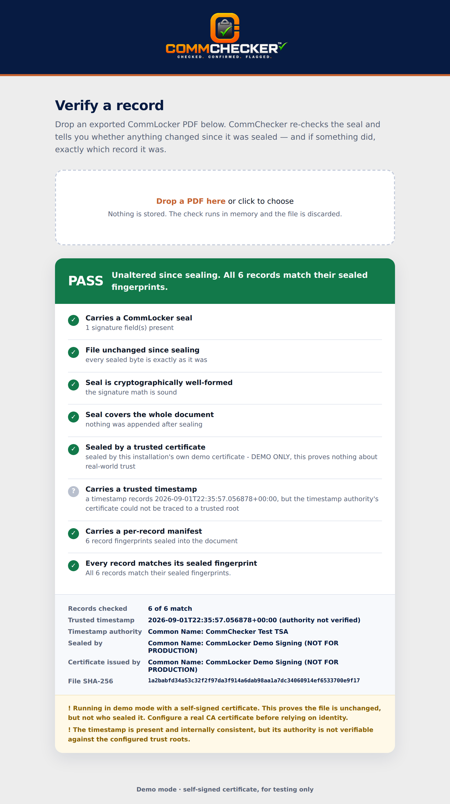
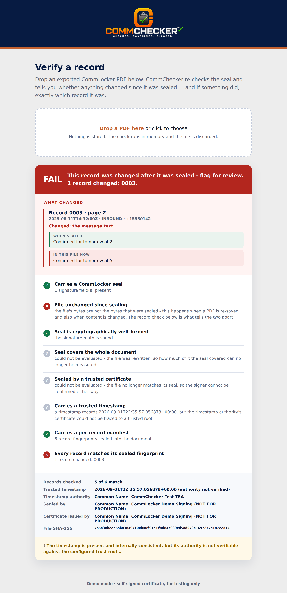
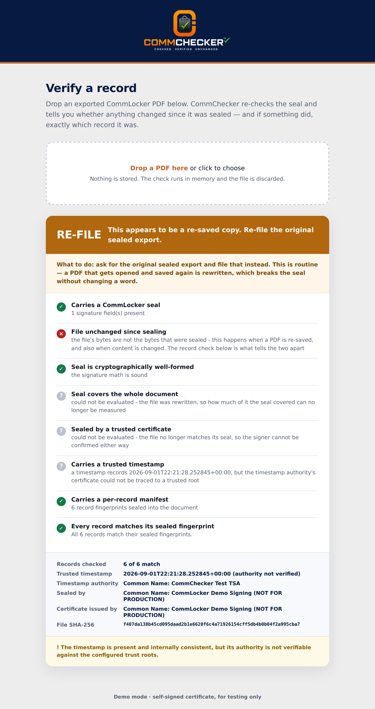
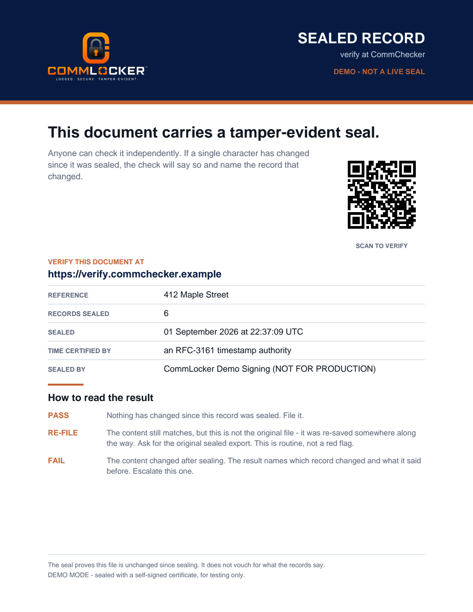
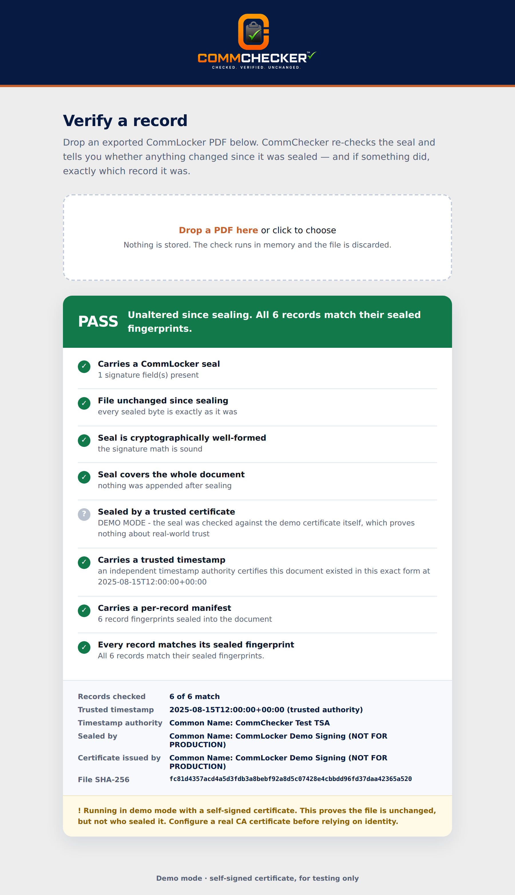

# CommChecker — "Computer #2"

Independent verification for exported CommLocker records. Drop in a PDF and it
answers one question:

> **Has anything changed since this record was sealed — and if so, what?**

The first half of that question is what the prototype already did. The second
half is what this step adds, and it is the part that closes a deal: not
"this document is suspect" but **"message 3, sent 11 August at 2:32pm, used to
say *Confirmed for tomorrow at 2* and now says *at 5*."**

---

## What this step added

| # | Change | Why it matters |
|---|--------|----------------|
| 1 | **The signing certificate is configurable** | Drop in a real Certificate Authority `.p12` for production. The demo certificate still runs the local demo, and production *refuses* to fall back to it. |
| 2 | **RFC-3161 trusted timestamp** | An independent authority certifies *when* the document was sealed. The seal keeps proving itself after your certificate expires. |
| 3 | **Per-record hash manifest** | Every record gets its own fingerprint, sealed into the document. On a FAIL, CommChecker names the exact record that changed and shows before/after. |
| 4 | **Deployable web service** | Processes uploads entirely in memory, stores nothing, ships as a container. Branded navy / burnt orange / soft white. |
| 5 | **Self-verifying cover page** | Every sealed export carries a front page with the record count, the timestamp, and a QR code + link to verify. The document proves itself in any system — no integration required. |
| 6 | **A FAIL that distinguishes sloppiness from tampering** | A re-saved file says *"re-file the original"* in amber. A changed record says *"flag for review"* in red, and names the record. |

---

## Try it in two minutes

```bash
cd commchecker
python -m venv venv && source venv/bin/activate
pip install -r requirements-dev.txt

python demo.py
```

You will see a record sealed, verified (**PASS**), edited, and verified again
(**FAIL**) — with the changed record named.

Then the web interface:

```bash
uvicorn web.app:app --reload
# open http://127.0.0.1:8000 and drag in sealed.pdf, then tampered.pdf
```

---

## What it looks like

**A clean record** — the seal holds and every record matches its fingerprint:



**A doctored record** — the tool does not just say "changed", it names the
record, the page, the time it was sent, and shows the wording before and after:



**A re-saved copy** — content intact, container rewritten. Amber, not red,
because this is routine and an alarm here teaches people to ignore alarms:



**The cover page** that travels with every sealed export:



**With a trusted timestamp** — an independent authority certifies the document
existed in this exact form at a specific moment:



---

## How it works, in plain English

Think of it as two locks on the same door.

**Lock 1 — the seal.** When a record is exported, we take a mathematical
fingerprint of the entire file and sign it with a private key. Change a single
byte anywhere and the fingerprint no longer matches. This catches *everything*,
but it can only tell you *that* something changed.

**Lock 2 — the manifest.** Before the seal is applied, we also take a separate
fingerprint of *each individual record* and attach that list to the document.
Because the list is attached before sealing, the seal covers it too — so nobody
can doctor a message and quietly rewrite its fingerprint to match.

When CommChecker verifies a file, it recomputes both. The seal says *something
moved*. The manifest says *which one*.

**The timestamp.** Separately, at sealing time we send a timestamp authority a
hash of the signature — never the document, never its contents — and it returns
a signed statement that this hash existed at that moment. That is what turns
"I say I sealed this in August" into something a third party attests to.

### What a record looks like on the page

Each record prints with a header line that a person can read and a computer can
parse:

```
RECORD 0003 | 2025-08-11T14:32:00Z | INBOUND | +15550142
Confirmed for tomorrow at 2.
```

Nothing is hidden — the numbering *is* the machine-readable format. The
production CommLocker exporter must emit records in this shape; see
`verifier/sample.py`, which is the reference implementation.

---

## Command line

```bash
python cli.py init                  # create the demo signing certificate
python cli.py config                # show settings and flag any problems
python cli.py sample export.pdf     # build a sample export to play with
python cli.py seal in.pdf out.pdf   # apply the seal + trusted timestamp
python cli.py verify file.pdf       # PASS (exit 0) / FAIL (exit 1)
python cli.py manifest file.pdf     # print the sealed per-record manifest
python cli.py demo                  # the whole story
```

Add `--json` to any command for machine-readable output.

---

## Going to production

Two documents cover it:

- **[CONFIGURATION.md](CONFIGURATION.md)** — every setting, in plain English,
  including how to buy and install a real CA certificate.
- **[DEPLOY.md](DEPLOY.md)** — putting the web service online.

The short version: buy a document-signing certificate (roughly $210–$510/yr),
then set four environment variables.

```bash
COMMCHECKER_MODE=production
COMMCHECKER_P12_PATH=/etc/commchecker/commlocker-signing.p12
COMMCHECKER_P12_PASSWORD=...
COMMCHECKER_TRUST_SYSTEM_ROOTS=1
```

Confirm it took effect by visiting `/config` on the running service, or running
`python cli.py config`.

---

## Privacy

The web service holds an uploaded document in memory for the length of one
request and then drops it. There is no database, no temporary files, and no
logging of document contents. This is enforced by tests
(`tests/test_web.py::TestNothingIsStored`), not just by intention.

---

## Tests

```bash
pytest
```

216 tests covering the manifest, sealing and verification, the timestamp path
(offline, using a local timestamp authority), certificate configuration, and
the web service.

`tests/test_security_regressions.py` pins the cases found in security review -
forged signing certificates, broken timestamps, hostile manifest attachments,
duplicate record numbering and unbounded uploads. Each one used to return a
green PASS or crash the server.

`tests/test_failure_reporting.py` pins the wording of each failure, including
that an alteration hidden inside a re-save still escalates.

---

## Branding

Two products, two logos, and keeping them straight matters:

> **CommLocker seals it** — its logo is on the sealed record (the cover page a
> broker opens).
> **CommChecker checks it** — its logo is on the verify tool (the PASS/FAIL
> page).

Logo files are placed exactly as supplied — never recoloured, flattened, traced
or regenerated. Navy `#071B42`, burnt orange `#C56230`, soft white `#EDEDED`.
See [brand/README.md](brand/README.md) for which file goes where.

---

## Honest limitations

Read these before you stake a pitch on the tool.

- **Demo mode proves integrity, not real-world identity.** The demo certificate
  is self-signed, so it shows a file is unchanged and that it was sealed by
  *this* installation - but nothing in the outside world vouches for that key.
  A document sealed with anyone else's key is correctly rejected; a document
  sealed with a genuine CA certificate needs production mode to be judged
  properly.
- **The record format is a contract.** Record-level detail works on exports that
  carry `RECORD nnnn | ...` headers. A sealed PDF without them still verifies —
  the report just says record-level detail is unavailable instead of implying
  more than it knows.
- **Trust roots must be configured.** With no roots, CommChecker cannot confirm
  who sealed a document, and returns FAIL rather than a PASS it has not earned.
  Production mode refuses to start without them.
- **Not yet built:** Android hardware key-attestation validation (the export's
  page-17 device proof), and PAdES-LTA long-term archival.
- **Get a security engineer to review the validation logic** before it carries
  legal weight. Validation done wrong gives a false green light, which is worse
  than no tool at all.
