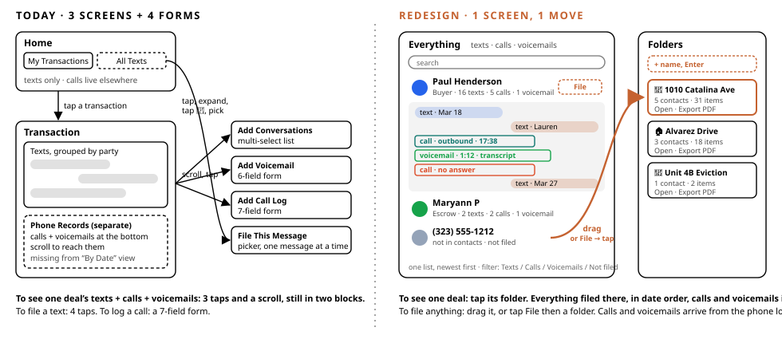
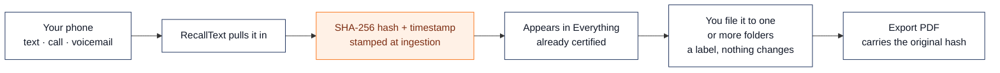
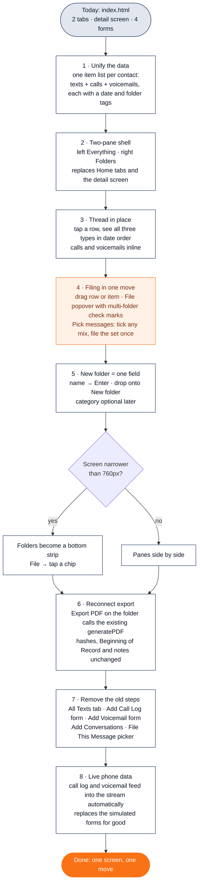

# RecallText Filing Desk — redesign plan

**One screen. Left is what's on your phone. Right is where it goes.**

Today the app splits a deal across two tabs, a detail screen and four forms, and calls and voicemails sit in a block of their own. The redesign puts every text, call and voicemail in one stream on the left, folders on the right, and makes filing a single drag or two taps.

- Clickable mockup: [`v2/index.html`](./index.html) · live preview: https://claude.ai/code/artifact/bf93e84c-06e0-4471-ad9d-4fde737d38c8 (runs on the app's real sample data; try dragging Paul Henderson onto a folder, or switch to the Phone view in the top bar)
- Before/after drawing: [`v2/before-after.svg`](./before-after.svg)

## In plain words

- **A row** is one line in the left list: one person or one number, for example the Paul Henderson line. Tap it and it opens to show every text, call and voicemail with that person.
- **Filing a conversation** starts with the **File…** button on its row. The conversation opens with every text, call and voicemail ticked. Untick what should stay out, tap **File picked**, tick one or more folders, Done. On a computer you can also drag the row onto a folder, which files all of it in one motion.
- **Filing** is a label, not a copy. It says "these records belong to the 1010 Catalina deal." The message, call log or voicemail is not changed, moved or duplicated. One item can carry several labels.
- **The hash** is stamped earlier than any of this, the moment the item is pulled off the phone. Filing happens after and cannot touch it. Every item in the mockup shows its "hashed at ingestion" line, and the export carries the same hash.

## Steps, today versus redesign

| You want to… | Today | Redesign |
|---|---|---|
| See one deal's texts, calls and voicemails | **3 taps + scroll.** Home → transaction → scroll past texts to "Phone Records". Calls and voicemails never appear in the By Date view. | **1 tap.** Tap the folder and you get the transaction timeline: everything filed there, from every person, in date order, calls and voicemails inline. "By person" groups the same items by contact. |
| File a text conversation to a deal | **4 taps.** All Texts tab → expand contact → tap 📁 on a message → pick the record. Repeat per message. | **3 taps.** File… on the row (everything ticked) → File picked → tap the folder. Untick anything that should stay out first. On a computer, dragging the row onto a folder files all of it in one motion. |
| Record a phone call | **3 taps + 7 fields.** Open transaction → scroll → Add Call Log → type name, number, date, duration, direction, notes. | **0 fields.** The call is already in the left stream from the phone's call log. Drag it to a folder. |
| Save a voicemail | **3 taps + 6 fields.** Open transaction → scroll → Add Voicemail → paste transcription and details. | **0 fields.** Voicemail and carrier transcript land in the stream under the caller. File it like anything else. |
| Start a new deal folder | **6 taps + 3 fields.** ＋ New Transaction → name → category → note → Create → Add Conversations → select → Add. | **1 field.** Type a name, press Enter. Or drop a conversation on "New folder" and name it. |
| File only part of a conversation | **4 taps per message.** Expand the contact, tap 📁 on one message, pick the record, close. Repeat. | **Tick, then file once.** Open the conversation, tap Pick messages, tick any mix of texts, calls and voicemails, then File picked. All or None in one tap. |
| Put the same messages in two or more deals | **Per message.** Tag each message separately. | **Tick more folders.** The folder list stays open with check marks; tap as many as apply, then Done. Chips on each item show where it lives. |
| Export a certified record | Transaction → Export → Preview → Download | Export PDF on the folder. Same generator, same hashes. |

## What the left pane shows

- **One row per person or number.** Name, role, number, the latest item with a type chip (Text / Call / Voicemail), counts, and the folders it is filed in. Unknown numbers and spam are in the same list, spam dimmed.
- **Filters instead of tabs.** All · Texts · Calls · Voicemails · Not filed yet. "Not filed yet" is the to-do list.
- **Tap a row to open the thread in place.** Texts as bubbles, calls and voicemails as cards, all on one timeline with date dividers. Each item has its own small File button and can be dragged on its own.
- **Pick messages.** Inside any open conversation, tap Pick messages and checkboxes appear on every text, call and voicemail. Tick what belongs to the deal (or All, then untick the personal ones). A bar at the bottom files the picked set to one or more folders in a single move. Unpicked items stay out of the folder.
- **Inside a folder** the list narrows to what is filed there. Items from the same conversation that are not in the folder hide behind "n more, show faded".
- **Checkboxes for bulk filing.** Tick several rows, a bar appears, "File selected to…".

## What the right pane shows

- **New folder is one field.** Name, Enter. It also accepts a drop: drop a conversation on it and it asks for a name.
- **Each folder card** shows icon, name, category, contact and item counts split by type, plus Open timeline and Export PDF.
- **Getting back out of a folder** is the orange "Back to all conversations" button at the top of the list, or tapping the same folder again.
- **Opening a folder shows the transaction as a timeline.** Every text, call and voicemail filed there, from every person, in one date-ordered stream with the sender named on each item. That is the record you export. Switch to By person to group by contact.
- **On a phone** the pane becomes a fixed block of folder chips along the bottom, all visible, nothing to scroll sideways. Tap a chip to open that folder's timeline.

## Flowchart of the changes

## How I would build it

The app is one file, `index.html`, with sample data and screens in the same script. The mockup was built from that file's real data, so this is the mockup's code moved into the app, step by step. Estimates are working days for one developer on the prototype.

1. **Unify the data (1 day).** Texts live in `ALL_CONVS`, calls and voicemails inside each transaction's `extra` list, and the All Texts tab has a third list (`ALL_TEXTS`). Merge into one list of contacts, each with items of type text / call / voicemail, a real timestamp, and a list of folder ids. Match calls and voicemails to contacts by phone number.
2. **Two-pane shell (1 day).** Drop the 430px phone frame as the only layout. One flex row: left pane, right pane; below 760px the right pane becomes the bottom strip. Replaces `#screen-home`, `#screen-detail`, `.bnav`, `.fab`.
3. **Thread in place (1.5 days).** Reuse the bubble renderer and the call/voicemail cards, rendered from one sorted item list with date dividers, inside the row. Keep notes, attachments, Identify and Beginning of Record on each item. Refactors `renderDetailByDate` + `renderExtraItem` into `renderThread(contact)`; deletes `renderDetailByParty`, `renderFullConv`.
4. **Filing in one move (1.5 days).** Rows and items draggable; folder cards and chips are drop targets. File button opens a popover of folders with check marks. Multi-select bar. Filing adds a folder id to the item and never edits the original. Replaces `openTagPicker`, `openSimpleTagPicker`, `openExtraTagPicker`, `openTextFilePicker`, `openAddConvs`.
5. **New folder is one field (0.5 day).** Name + Enter; drop on New folder creates and files. Category, icon and notes become an optional edit using the existing category grid.
6. **Reconnect export (0.5 day).** Export PDF on a folder builds the input `generatePDF` expects from the items tagged to that folder. Hashes, Beginning of Record and notes unchanged.
7. **Remove the old steps (0.5 day).** Delete `m-call`, `m-vm`, `m-add-convs`, `m-tag`, `switchHomeTab`, `renderAllTexts`, `addCall`, `addVM`. Keep Identify Caller, the annotation sheet and the incoming-call demo.
8. **Live phone data (native app work).** The forms existed only because the prototype can't read a phone. In the shipped app the call log and voicemail feed fill the stream on their own. iOS does not let third-party apps read call history; Android exposes `CallLog` and visual voicemail providers. Confirm with the mobile developer.

**Total for the web prototype:** about 6 to 7 working days, shipped at `recalltext.io/v2` first so the current demo stays untouched.

## What stays and what goes

| Stays | Goes |
|---|---|
| Navy and orange brand, Plus Jakarta Sans | My Transactions / All Texts tabs |
| Certified PDF export with SHA-256 hashes | Separate transaction detail screen |
| Beginning of Record marker | "Phone Records" block at the bottom |
| Agent notes, clearly marked as added | Add Call Log form (7 fields) |
| Identify Caller with carrier metadata preserved | Add Voicemail form (6 fields) |
| Categories and role templates, now optional | Add Conversations multi-select sheet |
| Incoming-call capture demo | File This Message picker |

## Three things to decide

1. **What should dragging a whole row do?** The mockup files every item in that conversation. The alternative is to open it in Pick mode with everything ticked so you can untick before filing. One extra tap, fewer personal messages in deal records. I lean toward the second for contacts who are also friends.
2. **Should "Not filed yet" nag?** A count badge on the filter is quiet. A daily reminder is not. Left quiet.
3. **Where does the pitch site go?** If the two-pane version replaces recalltext.io, the incoming-call demo needs a new home, probably a button in the top bar.
